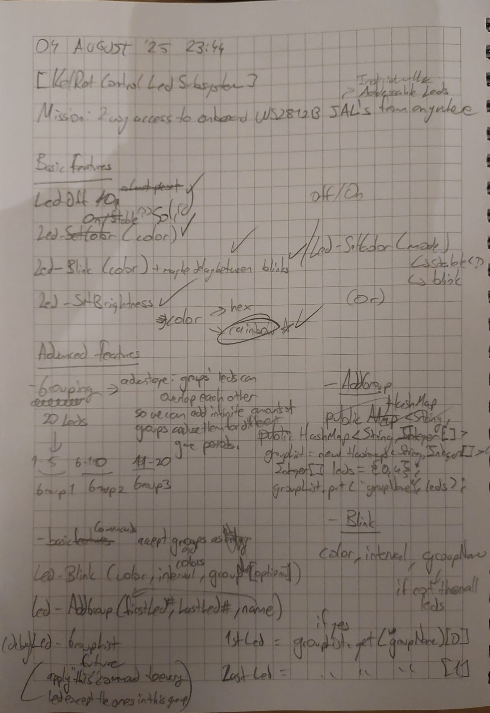
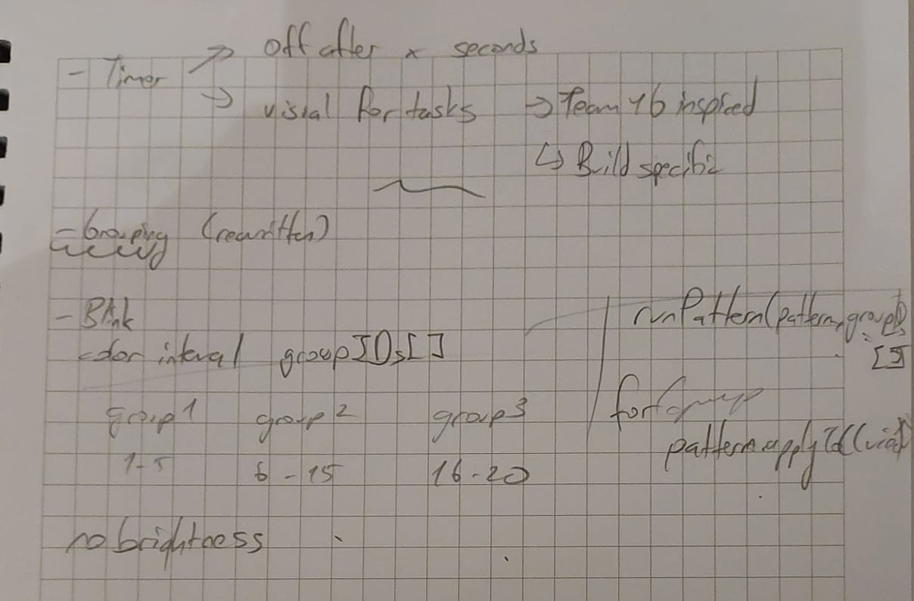

# Led Subsystem

A ready-to-use subsystem to easily control onboard WS2812B Individually Adressable Leds for status updates and driver communication.

## How has this subsystem been written?

### 1. Decide on goals

- Every subsystem is written to achieve a goal/goals. Deciding and writing down these goals can greatly help in the programming process.
- Firstly, try your best to sum up the general purpose in one sentence, as you can get to the details in another section.

**The Goal/Mission/General Purpose for this subsystem was:**

      To provide easy access to onboard WS2812B IAL's for every situation.

~~pretty fancy ik.~~

### 2. List out basic & advanced features/functions

- Write down everything this subsystem does and sort it out
- Basic features are the ones that are easy to implement and build the foundation for advanced features.
- Advanced features take more time and effort to implement, but are the ones that get used the most. They are usually built on top of the basic features or need multiple basic features to work.

**Features List for this subsystem:**

| Basic Features | Advanced Features |
| ----------- | ----------- |
| Turn Off | Led Grouping |
| Solid Color | Timer (WIP) | 
| Blink Effect | Visual Timer (WIP) | 
| Rainbow Effect |  | 
| Brightness (cancelled) |  | 

### 3. Find resources

- Always find out how WPILib or other 3rd party libraries can help you:
    1. Search [WPILib Docs](https://docs.wpilib.org/en/stable/index.html) for examples and detailed explanations inline with your goals.
    2. Ask your **seniors**!
    3. Checkout [ChiefDelphi](https://www.chiefdelphi.com/) and [GitHub](https://github.com/search?q=FRC&type=repositories) for inspiration or more examples from other teams.

> Skipping this step and directly writing pseudo code is strongly NOT recommended, as there might be useful/crucial methods in some of the libraries. ~~I have done it, cost me long hours~~

### 4. Finally start coding, wait, no - BRAINSTORMING + PSEUDO CODE

- Pseudo Code is basically to write a code in its **simplest** form, no syntax, no tabbing, just plain sentences + some arrows if needed. 
- Pseudo Code is your tool to note your **brainstorming** session, think about how a feature/function should work within self and with others.
    - Brainstorming is one of the longest processes with programming; all of the problem-solving, logical thinking abilities are used here.
    - If you can't figure out something: *1.* research *2.* ask *3.* take a walk
- I highly recommend using a paper notebook, because physically and rapidly writing something down smoothens the brainstorming.

**Photos of my notebook including the initial goal, feature lists, brainstorming and scratches of pseudo code:**
(your writings may be longer as I do most of these steps in my head)

 

### 5. Programming

1. Always set up your programming environment first, copy this project or create a new Command-Based Project to replicate a development branch of our robots.

2. Use examples, your research, and knowledge to write down the subsystem step-by-step, going from basic features to the advanced ones.

       🍏 Like everything, programming takes lots of practice and effort to become good at it. Trust me, after a few tries you'll be able to write code more smoothly than before. 

3. Write as clean as possible, clean code helps you and other developers to understand the subsystem's functions and improve with ease.
    - Some basic rules to follow:
        - Use camelCase for variable naming. (m_ledGroupNameList etc.)
        - Don't place unnecessary lines between the code.
        - Add comments where it's necessary

### 6. Review

- Seniors and mentors are there for a reason; don't be afraid to ask for a review. Feedback is your #1 source to improve yourself.

## Authors

  - **Mert** - *elma* -
    [life motto](https://dontasktoask.com/)
    

### Built With ❤️
